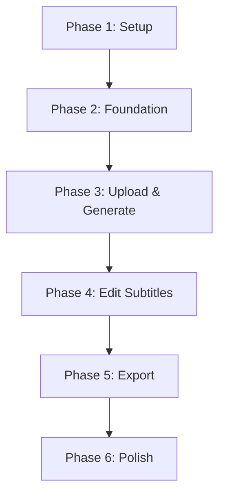

# Implementation Tasks: Speech-to-Subtitle Editor

## Phase 1: Project Setup

- [ ] T001 Initialize backend Go project structure
- [ ] T002 Initialize Next.js frontend project with TypeScript and TailwindCSS
- [ ] T003 Set up PostgreSQL database container
- [ ] T004 Configure Whisper CLI/API integration
- [ ] T005 [P] Create initial documentation structure
- [ ] T006 Set up WebSocket server configuration
- [ ] T007 Configure development environment variables

## Phase 2: Foundation

- [ ] T008 Create database migration system
- [ ] T009 Implement WebSocket connection handler
- [ ] T010 Set up file upload infrastructure
- [ ] T011 Create waveform generation utility
- [ ] T012 Implement basic error handling system
- [ ] T013 Set up logging infrastructure

## Phase 3: Upload and Generate Subtitles [US1]

- [ ] T014 [US1] Create AudioFile model in backend/models/audio_file.go
- [ ] T015 [P] [US1] Create file upload component in frontend/components/FileUpload.tsx
- [ ] T016 [US1] Implement file processing service in backend/services/processor.go
- [ ] T017 [US1] Create Whisper service integration in backend/services/whisper.go
- [ ] T018 [P] [US1] Implement progress indicator component in frontend/components/Progress.tsx
- [ ] T019 [US1] Add WebSocket events for upload progress
- [ ] T020 [US1] Create subtitle generation handler in backend/handlers/subtitle.go

## Phase 4: Edit Subtitles [US2]

- [ ] T021 [US2] Create Subtitle model in backend/models/subtitle.go
- [ ] T022 [P] [US2] Create timeline component in frontend/components/Timeline.tsx
- [ ] T023 [P] [US2] Create waveform visualization in frontend/components/Waveform.tsx
- [ ] T024 [US2] Implement subtitle editing service in backend/services/subtitle.go
- [ ] T025 [P] [US2] Create subtitle editor component in frontend/components/SubtitleEditor.tsx
- [ ] T026 [US2] Add WebSocket events for subtitle updates
- [ ] T027 [US2] Implement timestamp adjustment handlers

## Phase 5: Export Subtitles [US3]

- [ ] T028 [US3] Create export service in backend/services/export.go
- [ ] T029 [P] [US3] Create export format selection UI in frontend/components/ExportOptions.tsx
- [ ] T030 [US3] Implement SRT export format
- [ ] T031 [US3] Implement WebVTT export format
- [ ] T032 [US3] Implement Premiere Pro XML export
- [ ] T033 [P] [US3] Add download progress indicator in frontend/components/ExportProgress.tsx

## Phase 6: Polish & Cross-cutting

- [ ] T034 Add error recovery mechanisms
- [ ] T035 Implement auto-save functionality
- [ ] T036 Add keyboard shortcuts
- [ ] T037 Optimize waveform rendering
- [ ] T038 Add loading states and placeholders
- [ ] T039 Implement responsive design adjustments
- [ ] T040 Add tutorial tooltips

## Dependencies

## Parallel Execution Opportunities

### Upload & Generate [US1]
- Frontend file upload component + Progress indicator (T015, T018)
- Backend models + Whisper integration (T014, T017)

### Edit Subtitles [US2]
- Timeline + Waveform components (T022, T023)
- Backend subtitle model + Frontend editor (T021, T025)

### Export [US3]
- Export UI + Progress indicator (T029, T033)
- Multiple export format implementations (T030, T031, T032)

## Implementation Strategy

1. MVP (Minimum Viable Product):
   - Complete Phase 1 & 2
   - Implement basic file upload and subtitle generation [US1]
   - Basic subtitle editing [US2]
   - Simple SRT export [US3]

2. Incremental Delivery:
   - Add advanced editing features
   - Implement additional export formats
   - Add polish features
   - Optimize performance

## Task Summary
- Total Tasks: 40
- Tasks per Story: US1(7), US2(7), US3(6)
- Setup & Foundation: 13
- Polish: 7
- Parallel Opportunities: 9 tasks can be executed in parallel